# Developer Guide <!-- omit in toc -->

- [1. Setting Up](#1-setting-up)
- [2. Design](#2-design)
- [3. Implementation](#3-implementation)
  - [3.1 Start Feature](#31-start-feature)
    - [3.1.1 Current Implementation](#311-current-implementation)
    - [3.1.2 Additional Implementation](#312-additional-implementation)
    - [3.1.3 Design Considerations](#313-design-considerations)
  - [3.2 Clean Feature](#31-automated-storage-cleanup-feature)
    - [3.2.1 Current Implementation](#311-current-implementation)
    - [3.2.2 Additional Implementation](#322-additional-implementation)
    - [3.2.3 Design Considerations](#323-design-considerations)
  - [3.3 Storage feature](#33-storage-feature)
  - [3.4 Storage handler](#34-storage-handler)
  - [3.5 Edit feature](#35-edit-feature)
    - [3.5.1 Current Implementation](#351-current-implementation)
    - [3.5.2 Additional Implementations](#352-additional-implementations)
    - [3.5.3 Design Considerations](#353-design-considerations)
  - [3.6 Continue Feature](#36-continue-feature)
    - [3.6.1 Current Implementation](#361-current-implementation)
    - [3.6.2 Design Considerations](#362-design-considerations)
    - [3.6.3 Additional Features](#363-additional-features)
  - [3.7 List feature](#37-list-feature)
    - [3.7.1 Current implementation](#371-current-implementation-1)
  - [3.8 Find Feature](#38-find-feature)
    - [3.8.1 Current Implementation](#381-current-implementation)
  - [3.9 Filter Feature](#39-filter-feature)
    - [3.9.1 Current Implementation](#391-current-implementation)
- [4. Appendix](#4-appendix)
  - [Product Scope](#product-scope)
    - [Target user profile](#target-user-profile)
    - [Value proposition](#value-proposition)
  - [User Stories](#user-stories)
  - [Non-Functional Requirements](#non-functional-requirements)
  - [Glossary](#glossary)
  - [Instructions for Manual Testing](#instructions-for-manual-testing)
    - [Launch and Shutdown](#launch-and-shutdown)
    - [Listing activities](#listing-activities)
    - [Continuing activities](#continuing-activities)
    - [Editing activities](#editing-activities)
    - [Graphing activities](#graphing-activities)
    - [Setting tag goals](#setting-tag-goals)

## 1. Setting Up
   * Prerequisites
     * JDK 11 or above
     * IntelliJ IDE
   * Setting up the project in your computer
     * Fork this repo, and clone the fork to your computer
     * Open IntelliJ (if you are not in the welcome screen, click File > Close Project to close the existing project dialog first)
     * Set up the correct JDK version for Gradle
     * Click Configure > Project Defaults > Project Structure
     * Click New…​ and find the directory of the JDK
     * Click Import Project
     * Locate the build.gradle file and select it. Click OK
     * Click Open as Project
     * Click OK to accept the default settings.
   * Verifying the setup
     * Run `jikan.jikan` and try a few commands
     * Run the tests and ensure they all pass.

## 2. Design
The section provides a high-level explanation of how the Jikan software is designed.

### 2.1 High-Level Architecture
The users interact with the Jikan software which modifies the local storage data file.

Within the Jikan software, there are 5 main components:
* **Parser Component** - Parses the user inputs and calls the relevant `Command` object to execute the desired
command.
* **Ui Component** - Prints to the user the output of the desired `Commands`.
* **Commands Component** - Contains all the `Commands` to be called by the `Parser` based on user inputs.
* **Activities Component** - Maintains the non-permanent state of all `Activities` in the `Activity List` to be accessed
by the executing `Commands`.
* **Storage Component** - Interacts with and modifies the local storage file, which contains the permanent (lasting
even after the program terminates) state of all activities. It retrieves this permanent state and populates the `Activity List` at the start of each session.

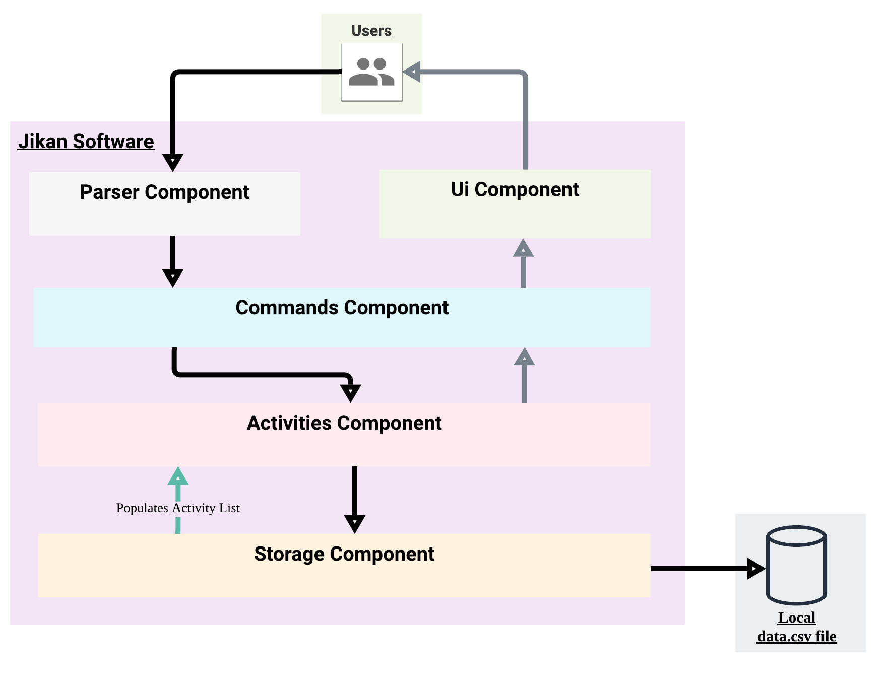
_Fig 2.1. Architecture diagram of the Jikan program_

### 2.2 Class Diagram
The high-level class diagram describes the structure of the components

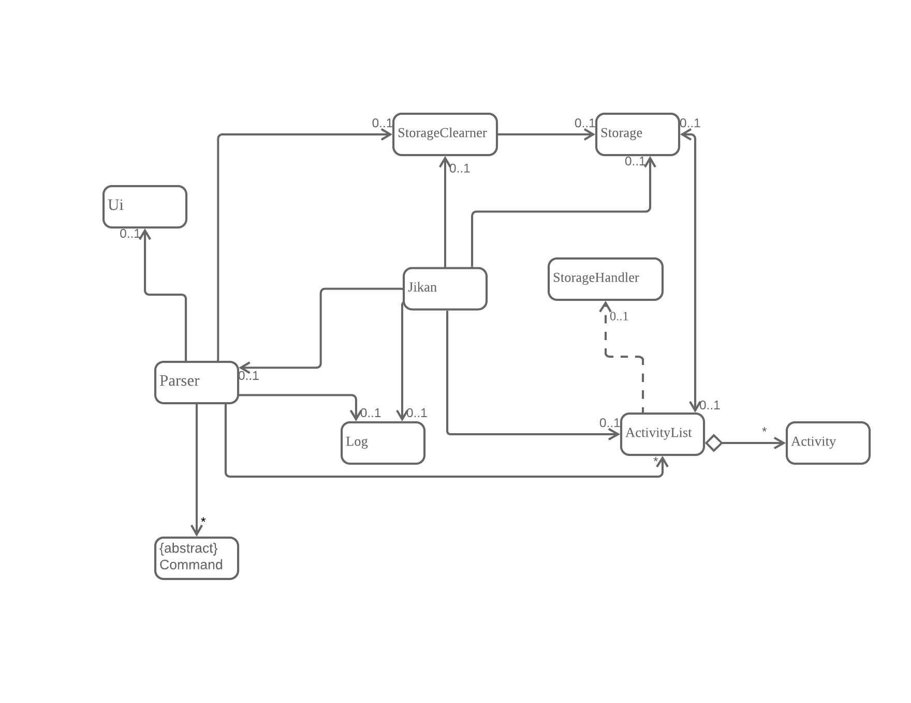
_Fig 2.1. Class diagram of the Jikan program_

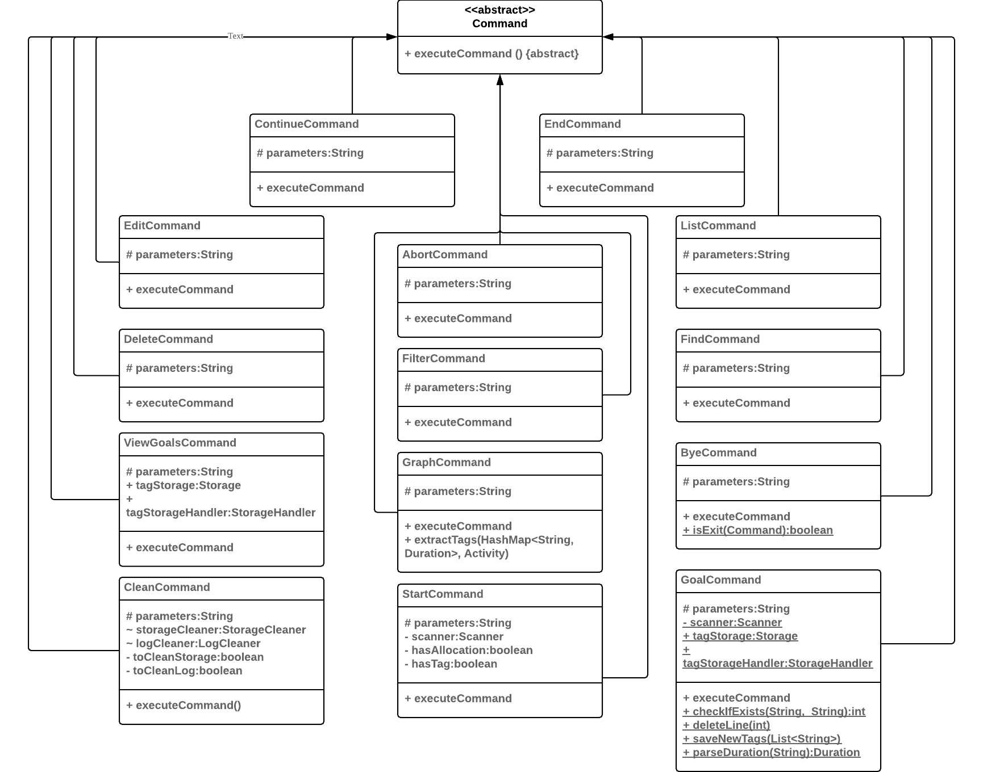
_Fig 2.2. Commands of Jikan (private methods omitted)_

All the commands inherit from the abstract `Command` class. Each command has a protected `parameters` attribute from it's Parent class `command` and an overridden method `executeCommand` which is called in `main` to execute the relevant command. 

## 3. Implementation

This section describes some noteworthy details on how certain features are implemented.

### 3.1 Start Feature

#### 3.1.1 Current Implementation

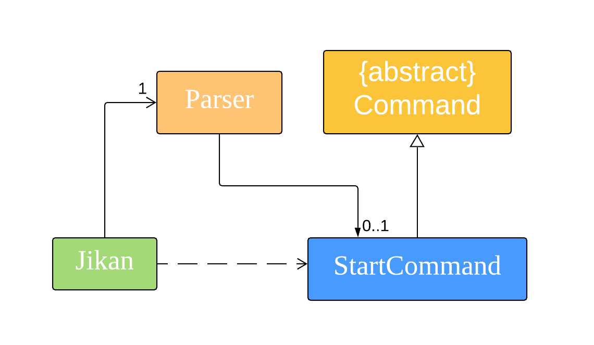

With Jikan as the main entry point for our application, 

1. Jikan will receive user input and pass it to the Parser class to get the corresponding command.
2. The Parser class will initialise and return a Command class object based on the command in user input.
3. In this case, Parser will return a StartCommand class object to Jikan.
4. Then, Jikan will call the StartCommand#executeCommand method to start an activity.

Additionally, StartCommand also implements the following operations:

* **StartCommand#checkActivity** Checks if the activity already exists in the activity list.
* **StartCommand#checkTime** Checks if the allocated time provided is valid.
* **StartCommand#continueActivity** Continue on an existing activity.

**checkActivity**

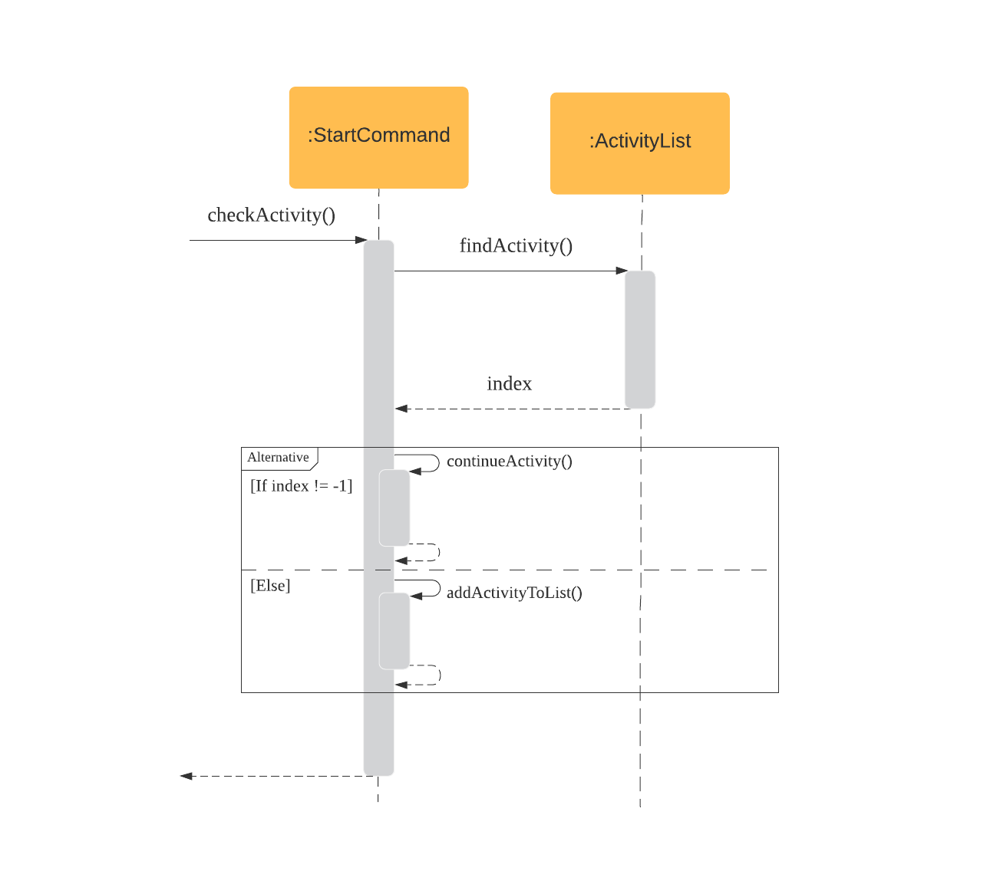

The diagram above shows how the StartCommand#checkActivity function works. This function is used to check 
if the activity to be started exists in the activity list. If the activity exists in the list, that activity will be 
continued and this way the user cannot start duplicate activities.

1. When checkActivity() is called, it will make a call to the ActivityList#findActivity method.
2. Once the findActivity() method finishes execution, it will return an integer index back to checkActivity().
3. If the index is not equals to -1, the activity to be started exists in the activity list and continueActivity() will be called.
4. Else, the activity to be started is a brand new activity and addActivityToList() will be called.

**checkTime**

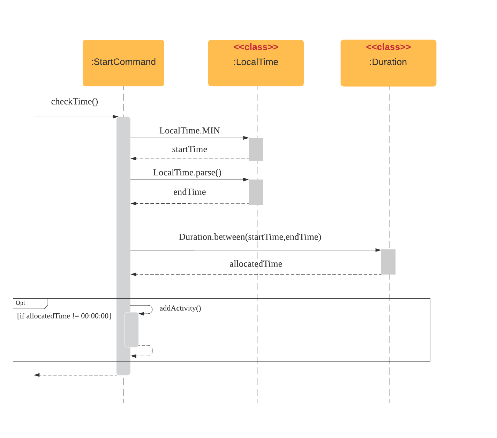

The diagram above shows how the StartCommand#checkTime function works. This function is used to check the validity of 
the allocated time provided by the user input. If the allocated time is valid, the activity will be added to activity
list.

1. When checkTime() is called, it will initialise two LocalTime objects called endTime and startTime respectively.
2. startTime will be initialised to time 00:00:00 while endTime will be calculated based on the user input to the start
command (i.e `start activity name /a HH:MM:SS /t tags`)
3. Then, the method Duration.between() will be used to get a Duration object that holds the time difference between startTime
and endTime.
4. If this Duration object is non zero (i.e user gave a valid non zero allocated time), then the activity will be added to the activity list
using the addActivity() method.

**continueActivity**

The diagram above shows how the StartCommand#continueActivity function works. This function is used when the current activity
to be started already exists in the activity list. Thus, this function will check with the user whether to continue on that activity 
and prevent duplicate activities from being started.

1. When continueActivity() is called, it will make a call to the Scanner object to read in the next line of user input.
2. If the user input is "yes", information about the activity (activity name, tags etc.) will be forwarded to parser and the parser
will update the activity list (i.e when continue is used, activity duration is added on and needs to be updated).
3. Else, if the user input is "no", continueActivity() will notify the parser to read in the next line of user input.

#### 3.1.2 Additional Implementation

1. `start` command have the ability to continue an activity if the activity to be started exists in activity list as discussed above. However, the second 
start command's tags and allocated time parameters will not be captured if the activity originally did have tags or allocated time.
    * `start activity 1`
    * `start activity 1 /a HH:MM:SS /t tags` (this command will continue activity 1 but won't add the tags and allocated time to it)

    Thus, it would be best for `start` command to address this issue and allow the second `start` command to not only continue the
activity but also edit the fields of the activity.

2. Allows two activities to start at the same time. As a user, sometimes the activity we are doing may be linked to another activity (i.e activities like 
revising CS2106 and doing CS2106 Labs are similar as doing the labs can serve like a revision too).

    Thus, it would be good if more than one activity can be started at a particular time.

#### 3.1.3 Design Considerations

The current design is centred around the Parser Class as all the relevant activity information (activity startTime, endTime, name, tags,
allocated time) are stored inside Parser.

Since Parser is a public class. There are some benefits to this design.
* All the command classes have access to activity information.
* Makes the classes more lightweight as there is no need for local variables to store activity informations.
* Reduces coupling between the commands as they interact through Parser.

However, there are some drawbacks to this design too.
* Since all the activity information are public, every class in Jikan can access/modify activity information which is
undesirable.
* This creates a lot of dependencies between Commands and Parser which makes unit testing harder to implement.
* As more commands is created to accommodate new features , Parser will be overloaded with new variables and classes.

### 3.2 Clean Feature

#### 3.2.1 Current Implementation

Jikan provides a `clean` command where users can automate the cleaning of done activities (i.e activities with duration > allocation) and logging data
at application startup.

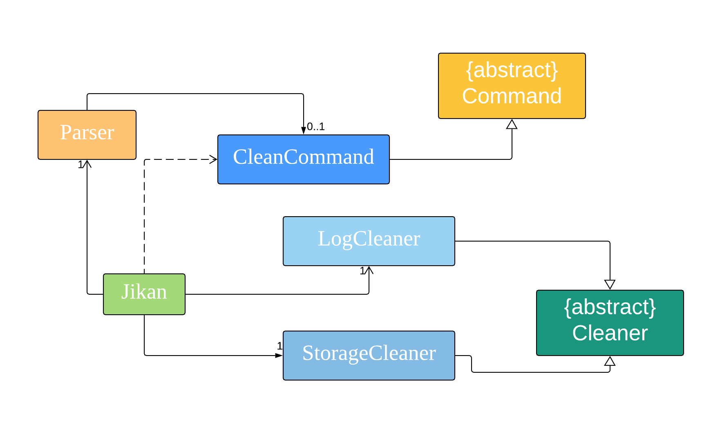

With Jikan as the main entry for our application,

1. Upon startup, Jikan will initialise a LogCleaner and StorageCleaner object.
2. Jikan will call upon LogCleaner#autoClean() and StorageCleaner#autoClean() functions.
3. These two functions will check if the Storage and Log Cleaner are enabled respectively before cleaning.
4. Thus, by the time the user can interact with Jikan (i.e send commands to Jikan), the activity list and log files would already be cleaned.
5. Using the `clean` command, users would be able to manage the cleaner's behaviour (switching it on/off, set number of done activities/logging data to clean).

The cleanup mechanism is stored internally as a StorageCleaner and LogCleaner class. 

These two classes have access to the data files of activity list and logs respectively and thus they are able to 
directly manipulate the activity list and logging data.

A status.txt file is initialised to keep track of the status (on/off) of the two cleaners and contains information on 
the number of done activities/logging data for cleaning.

Moreover, the CleanCommand also implements the following operation:

* **CleanCommand#setStatus** Switch on/off the two cleaners respectively.
* **CleanCommand#setValue** Set a value for the number of done activities/logging data to be cleaned.
* Note: The two cleaners are independent, setting a value/status for one of the cleaner will not affect the other cleaner.

**setStatus**

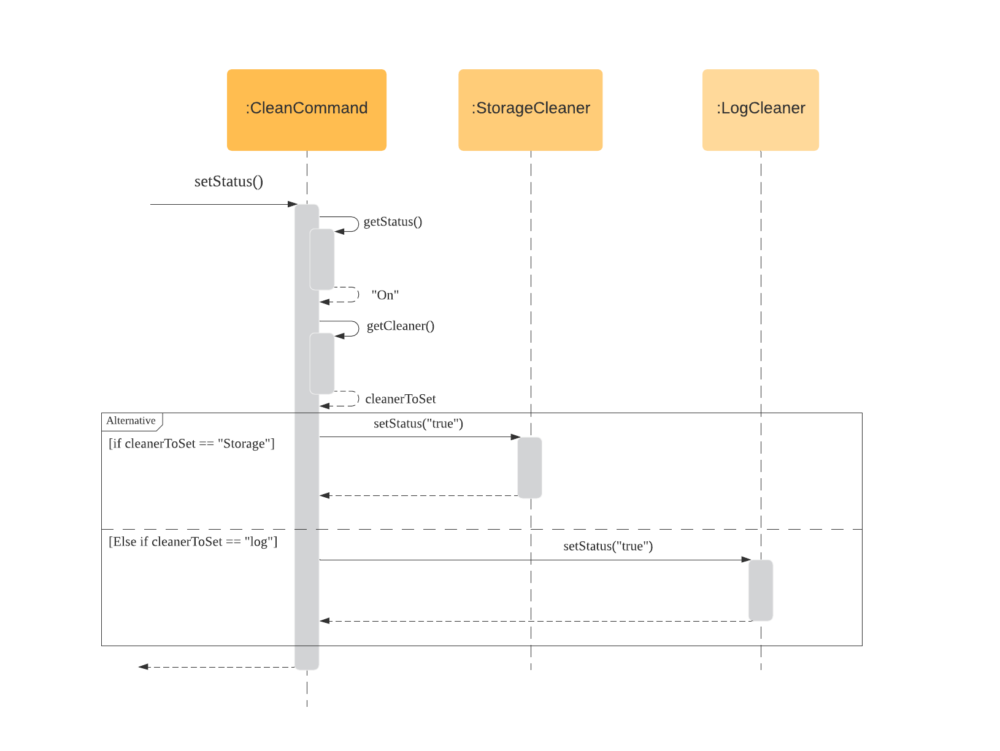

The diagram above shows how CleanCommand#setStatus function works. This function is a generalized function that is used to
switch on or off the cleaners by checking the parameters to the `clean` command. Thus, based on the return value of getStatus() and
getCleaner(), there are four possible scenarios.

1. When setStatus() is called, the method will call its own class method getStatus() to check what is the status to set to.
2. There are two valid return values for getStatus() method which is "on" and "off". The diagram shows the former.
3. Upon receiving a valid return value from getStatus() which is "on" in the diagram, the setStatus() method will self invoke another
of its own class method getCleaner().
4. The return result of the getCleaner() together with getStatus() will then be used to determine which cleaner are we setting and what is
the status to set to. 
5. In other words, result of getCleaner() is used to determine whether are we calling StorageCleaner#setStatus or LogCleaner#setStatus while
the result of getStatus() determines the parameter to setStatus(). (e.g "on" will call setStatus("true") while "off" will call setStatus("false")).

**setValue**

The diagram of setValue is omitted as it is similar to setStatus diagram. This function is a generalized function that is used to 
set a value for the number of done activities or the number of lines of logging data to be cleaned for the two cleaners respectively.

1. When setValue() is called, the method will call its own class method getNumber() that will return an integer value corresponding to the number 
to set to.
2. Upon receiving a valid return value (non negative), the setValue() method will self invoke another of its own class method getCleaner().
3. The return result of the getCleaner() together with getNumber() will then be used to determine which cleaner are we setting and what is 
the value to set to.
4. In other words, result of getCleaner() is used to determine whether are we calling StorageCleaner#setNumberOfActivitiesToClean or LogCleaner#setNumberOfLogsToClean
while the result of getNumber determines the parameter to these two functions.

Note that steps 2-4 of setValue() are similar to steps 3-5 of setStatus().

On the other hand, the Storage/Log Cleaner class implements the following core operation of `clean` command.

* **Cleaner#autoClean** This operation is called whenever Jikan is executed. Cleaning will only be done to the activity list/logging data if
the two cleaners are enabled respectively.

**autoClean**

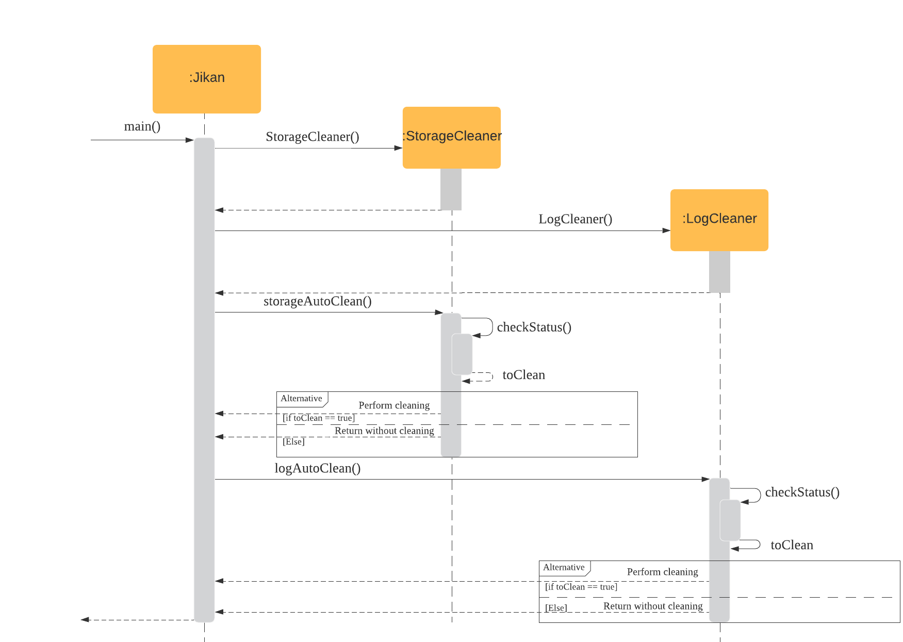

The diagram above shows how Cleaner#autoClean function works. This function is called whenever Jikan executes Jikan#main and is used to
perform cleaning of the activity list and logging data if Storage Cleaner and Log Cleaner are enabled respectively. The number of done activities and
lines of logging data to clean is set to 5 at default if user did not specify a value for both cleaners.

1. When main() is called, Jikan will first initialise both the StorageCleaner and LogCleaner object using StorageCleaner() and 
LogCleaner().
2. Once both objects are initialised, Jikan will first call storageAutoClean() method of the StorageCleaner class.
3. This method will invoke another method under the StorageCleaner class called checkStatus() which will return a boolean toClean variable.
4. If toClean == true, the storageAutoClean() method will proceed and clean up the activity list before returning control back to main().
5. Else, the storageAutoClean() will not do any clean up and will immediately return control back to main().
6. Steps 2 to 5 will then be repeated when Jikan call logAutoClean() method of the LogCleaner class. 

#### 3.2.2 Additional Implementation

1. Currently, the data that is cleaned up by this command is sent to a recycled folder similar to how Windows recycle bin works. 

    Thus, it would be good to have a feature to restore the data deleted in the event the user wishes to recover some of the activities/logs.
    
    On a similar note, it would also be good to have a permanent delete feature built into the recycled folder so that items that are too old (> 6 months old) will
    deleted away for good.
    
2. The automated cleaning does not have a lot of flexibility as the current implementation only cleans up done activities starting from the oldest.

    Thus, it would be good if the `clean` command is expanded to allow users more freedom in specifying what activities to clean.
    
    * `clean /n 3 /t CS2113` does cleaning on the 3 oldest done activities with CS2113 tag.
    * `clean /n 5 /i 1/4/2020 3/4/2020` does cleaning on the 5 oldest done activities with dates between 1 April 2020 and 3 April 2020.
    

#### 3.2.3 Design Considerations

The current design uses the abstract cleaner class to create dedicated cleaners (i.e Storage and Log Cleaners) to perform
cleaning for various data files (e.g activity list data file, logging data file).

There are some benefits to this design.
* Creating an abstract class reduces the amount of repetitive code as common methods between cleaners are abstracted out.
* Abstract classes produce a more OOP solution as different cleaners will handle different parts of the data.

However there are drawbacks to this design too.
* There are some very similar methods with key differences that cannot be abstracted out (for e.g different parameters, different printing).
* This causes the CleanCommand class to have similar and repetitive methods to handle this difference. (for e.g setStorageCleanerOn(), setLogCleanerOn() etc).

### 3.3 Storage feature
The Storage class represents the back-end of Jikan, handling the creation, saving and loading of data. 
Jikan uses a `.csv` file to store its data, formatted in the following way:

`entry-name, start-time, end-time, duration, tags`

All tags are saved in the same cell, separated by a white space; this design decision was taken to make sure that each entry occupies the same number of cells regardless of each entry’s number of tags. The tags are then separately parsed when the data is loaded.

Each Storage objects contains the path to the data file (`Storage.dataFilePath`), the File object representing the data file (`Storage.dataFile`), and an activityList populated with the data from the data file (`Storage.activityList`). Storage optionally supports multiple data files at the same time, allowing implementation of features like multiple sessions and multiple user profiles. 

Storage provides the following functions:
- Constructing a Storage object via `Storage(String dataFilePath)`, which takes in the path to the desired data file (or the path where the user wants to create the data file) as a String object.
- Creating a data file via `createDataFile`.
- Writing to a data file via `writeToFile`. This function takes a single string as parameter and writes it to the data file. It is recommended to only pass single-line strings to keep the file nicely formatted. 
Loading a pre-existing data file via `loadFile`. If a data file already exists for the provided data file path, the function will return `true`; if the specified data file did not previously exist, this function will call the `createDataFile` method and returns `false`. The return value is useful so that the application knows whether or not this is the first session with a specific data file or if data already exists.
- Creating an ActivityList via `createActivityList`. This function calls `loadFile()` to check whether the file already existed or not; if the data file previously existed, it will construct an ActivityList object by passing the data from the data file to it, and return this populated ActivityList object; if the data file did not previously exist, it will return an empty activityList object.

### 3.4 Storage handler
The StorageHandler class functions as a support to the main Storage class, allowing the Jikan application to manipulate the stored data file. Its main provided functions are:
- Removing an entry from the data file via `removeLine`. This function takes in the number of the line to remove.
- Replacing an entry in the data file via `replaceLine`. This function takes in the number of the line to replace, along with the String object that needs to be written to the data file in place of the replaced line.

### 3.5 Edit feature
The edit feature allows the user to make changes to activities that have been saved in the activity list. This is to allow the user to rectify any mistakes that may have been made during the initial recording of the activity. 

#### 3.5.1 Current Implementation
The following sequence diagram shows how the edit feature works.
The current implementation of the edit feature allows the user to edit the activity name as well as its allocated time.
The following sequence diagram shows how the edit feature works for editing the activity name. The diagram for the editing of allocated time is omitted as the sequence is relatively similar.

The current implementation of the edit feature allows the user to edit only the name and allocated time parameter of the activity. When the user wants to edit an activity using the edit command, a new EditCommand object is created. The `executeCommand()` method of the EditCommand object is called and the specified parameters are updated accordingly.

The order of method calls to edit the activity details is as follows if the specified activity exists (meaning `index != -1`) else an exception is thrown:
1. The `updateName()` method of the ActivityList class is called, with the user-specified parameters of the activity index and new activity name
2. The `get()` method is self-invoked by the ActivityList class to obtain the activity at the given index 
3. The `setName()` method of the Activity class is called to edit the activity name to the user-specified name
4. The activity is updated with its new name in the activityList.
5. The `fieldChangeUpdateFile()` method of the StorageHandler class is called to update the data file with the new activity name.

#### 3.5.2 Additional Implementations
The current implementation of the edit feature only allows the user to edit the activity name and allocated time. Hence, additional implementations of the edit feature could allow the user to edit other parameters of the activity such as the tags and the start and end dates. 

This will require the implementation of more update methods in the ActivityList class to allow for the changes to be updated in the activityList after it has been edited. 

#### 3.5.3 Design Considerations
##### Current Design
The user is able to edit only the name and allocated time of the activity, which are user input data.     

Pros:
* The user is able to correct any mistake made during the recording of the activity.
* The user is able to adjust their allocated time for the activity based on their needs.
* Ensures that the record of activities is accurate and consistent in order for more efficient analysis of the time spent.

Cons: 
* The user is only able to edit 2 parameters of the activity, which may be restrictive for them.  

##### Possible Design
The user is able to edit any parameters of the activity, including tags, start and end date/time. 
 
Pros:
* The user has more flexibility in modifying the record of activities based on their needs.

Cons:  
* By allowing the user to edit the date and time, there may be potential inaccuracies in the record of activities, defeating the purpose of the time tracking program. 
* By allowing the user to edit the tags, the tag goals command may become more complicated due to the need to keep track of the presence of the tags.

### 3.6 Continue Feature
The continue feature allows the user to continue a previously ended activity.

#### 3.6.1 Current Implementation
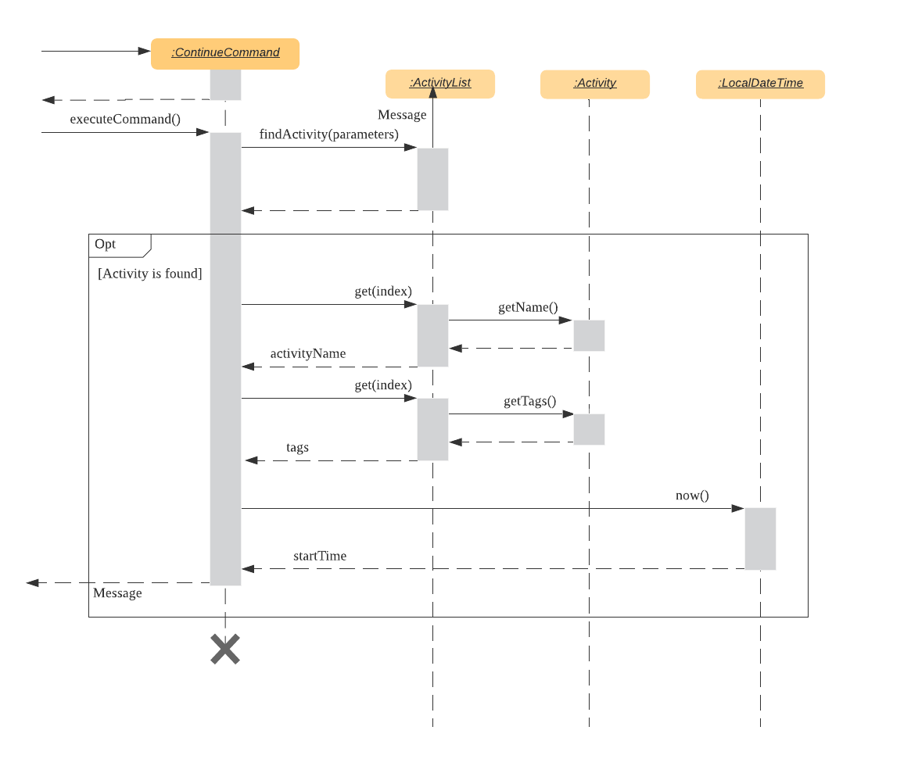

**Continuing an activity:**
* When the user enters the command to continue an activity, a *ContinueCommand* object is created in *Parser*. The method `executeCommand()` of the *ContinueCommand* object is then called.
* `executeCommand` checks if the given activity name exists in the activityList by calling `findActivity()` (if it doesn’t an exception is thrown, omitted in the sequence diagram above)
* It then gets the `name` and `tags` of the activity to be continued and saves it to a public static variable of *Parser* object.
* It also gets the current time and saves it to a public static variable of *Parser* object.
 
 

 **Ending a continued activity:**
* When the user wants to end the continued activity, an *EndCommand* object is created in *Parser.* The method `executeCommand()` of the *ContinueCommand* object is then called and it in turn executes the `saveActivity()` method of the *ActivityList* class.
* `saveActivity()` gets the current time and saves it to a public static variable of *Parser* object.
* Then the elapsed time is calculated using the `between()` method of *Duration* class.
* The elapsed time is added with the previous duration of the activity to get the `newDuration` using the `plus()` method of Duration class.
* `updateDuration()` method is called to update the `duration` attribute of the continued activity in the `activityList` as well as the `data.csv` file.

#### 3.6.2 Design Considerations

**Execution:**
 * Continue by activity name (current implementation)
   * **Cons:** Activity names have to be unique.
   * **Pros:** More versatile, resistant to changes in the activity list
 * Continue by activity index
   * **Cons:** need to add an additional index field to the Activity class, 
 index is not fixed, changes when an activity is deleted
   * **Pros:** Can reuse activity names.
 
Although the current implementation of the continue feature disallows users to have multiple activities with the same name, we felt that the versatility of this choice outweighed the cons. Firstly because if the activityList got too big, it would be hard for the user to get the index of the task they wanted to continue. Also, the index would constantly be changing when changes are made to the list.

#### 3.6.3 Additional Features
As users can only have activities with unique names, when a user wants to start an activity which already exists in the activityList, they will be given the option to continue the stated activity.
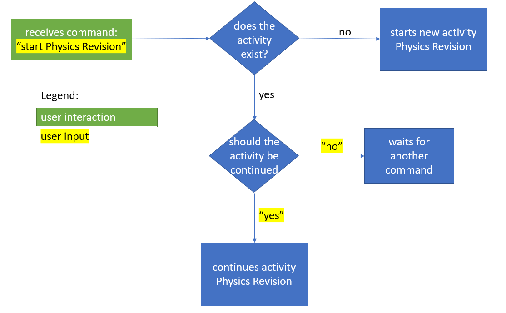

### 3.7 List feature
This feature is used to list activities within a range specified by the user.
If no parameter is passed to the `list` command, then all the stored activities will be displayed.
By passing a single date, the command returns all activities within that date.
By passing two dates, the command returns all activities that took place within the two dates.
(for an activity to be included in the range, both its start and end time must be within the specified time range).
The user can also provide a verbal command, such as `day`, `week`, or `month`, which
will return all the activities for that day, week or month respectively.
Additionally, the user can specify a specific week of month by including a date
(e.g. `list month 2020-03-01` returns all the activities in March 2020.)

#### 3.7.1 Current implementation
* List all activities: `list`
    * List today's activities: `list day` or `list daily`
    * List this week's activities: `list week` or `list weekly`
        * List a specific week's activities by day: `list week DATE` or `list weekly DATE`, 
        where `DATE` is in either `yyyy-MM-dd` or `dd/MM/yyyy` format
    * List this month's activities: `list month` or `list monthly`
        * List a specific month's activities by day: `list month DATE` or `list monthly DATE`, 
        where `DATE` is in either `yyyy-MM-dd` or `dd/MM/yyyy` format
    * List a specific day's activities: `list DATE`, where `DATE` is in either `yyyy-MM-dd` or `dd/MM/yyyy` format
    * List activities within a time frame: `list DATE1 DATE2`, where both `DATE1` and `DATE2` are 
    in either `yyyy-MM-dd` or `dd/MM/yyyy` format

### 3.8 Find & Filter Features

#### Find Feature
This command accepts keyword(s) and searches either the entire activity list or the last shown list for activities with 
names containing each keyword.

#### Filter Feature
This feature accepts space-separated keyword(s) to search either the entire list or the last shown list 
for activities with tags matching each keyword. The keywords should be an exact-match with the tag names.

#### 3.8.1 Design Considerations
As the `find` and `filter` commands are important for the user to analyse and eventually graph time-spent on each 
activity. The user should be allowed to query for all useful combinations of activities in the activity list. 
This entails:
* The user should be allowed to match for multiple keywords at once.
* The user should be allowed to exclude certain activities by limiting his search to a previously shown list as 
    opposed to the entire activity list.
    (chaining `list`, `find`, and `filter` commands).

  

#### 3.8.2a Current Implementation for Find
* This feature is called by the user when the `find` command is entered into the command line. 
The string following the command are the parameters:
    * `-s` flag indicates that the searching should be limited to activities previously shown to the user.
    * The remaining parameters are a string of keywords separated by ` / `. 
* The Parser will create a FindCommand object.
* The FindCommand will invoke its own `executeCommand()` method.
    * The Parser's `lastShownList` will be cleared.
    * Then it will loop through `activityList` to find activities with names that contain the keyword.
    * If one is found, it will be added to `lastShownList`.
    * `printResults()` of the Ui will be called:
        * If `lastShownList` is not empty, it will print the matching activities.
        * Else, it will respond to the user that there are no tasks which match the given keyword.

#### 3.7.3 Sequence Diagram
The following illustrates the execution sequence of a general use case. Due to the similarities between `find` and 
`filter` sequences, the sequence diagram of `filter` is omitted.

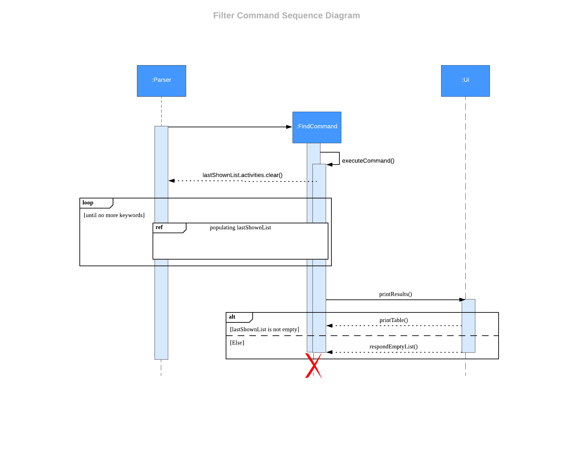
*Sequence Diagram for Find Command*

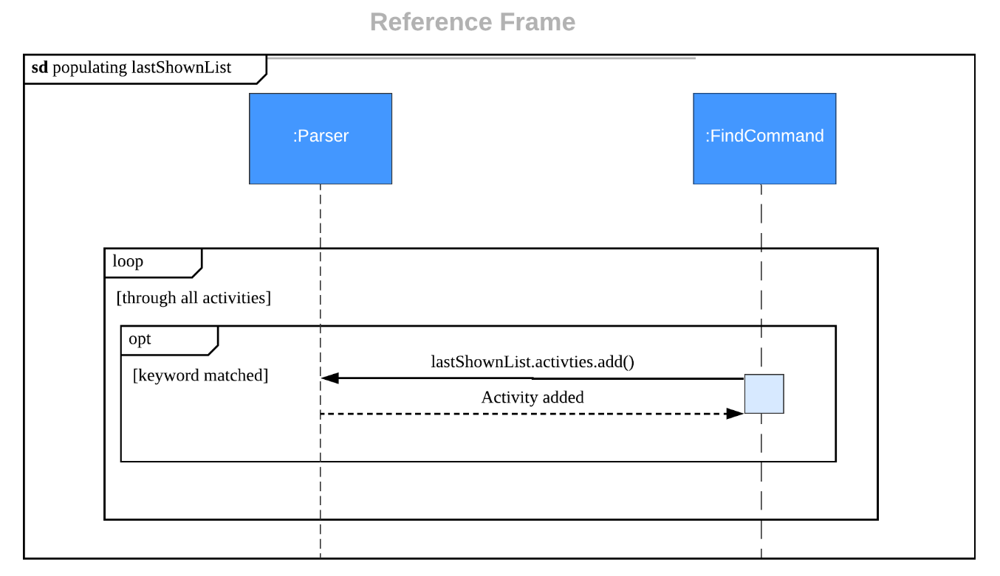
*Reference frame for populating last shown list*

### 3.9 Filter Feature
This feature accepts multiple space-separated keywords to search for activities with tags matching each keyword.

#### 3.9.1 Current Implementation
* This feature is called by the user when the `filter` command is entered into the command line. The space separated strings following the command are the keywords to match activity tags with.
* The Parser will create a FilterCommand object.
* The FindCommand will invoke its own `executeCommand()` method.
* The Parser's `lastShownList` will be cleared.
* For each keyword:
    * Then it will loop through `activityList` to find activities with tags that contain the keyword.
    * If one is found, it will be added to `lastShownList`.
    * `printResults()` method of the Ui will be called
        * If `lastShownList` is not empty, it will print the matching activities.
        * Else, it will respond to the user that there are no tasks which match the given keyword.

#### 3.7.4 Additional features
`find` and `filter` command supports the limiting of searches to activities in the last shown list. This
is done in 2 ways:
* The `-s` flag following the command (eg. `find -s keyword`)
* The `;` delimiter for a combination of `find` and `filter` in a single input (eg. `find KEYWORD ; filter TAGNAME`)

 

### 3.10 Graph Feature
This feature gives the user a visual representation of their activity duration and activity goals.  
Graph can be used along with `list`, `find` and `filter` to sieve out the data to be graphed.

#### 3.10.1 Current Implementation

* This feature is called by the user when the `graph` command is entered into the command line. The user will then have to specify what he would like to graph (goals progress bar / tag duration / activity duration).
* The Parser will create a GraphCommand object.
* The GraphCommand will invoke its own `executeCommand()` method.  

**Graph allocations**  
This displays the progress bar for the duration with respect to allocated time of activities in the `lastShownList`. 
* If the user indicated `targets`, Ui calss will be called to execute graphTargets.

**Graph tags**  
This displays a bar graph of the cumulative duration of the tags for each activity in the `lastShownList`.
E.g. if 3 activities in the `lastshownlist` are tagged `CS2113`, the durations of these 3 activities are added up and associated with the tag `CS2113` in the graph.
* If the user indicated `tags`, `GraphCommand` will call it's own `graphTags` method.
* A HashMap (`tags`) of tags to duration is created.
* `graphTags` iterates through every activity in `lastshownlist` and in each loop, `extractTags` is called.
* `extractTags` loops through the tags of that activity. Tag is added to the `tags` if it is not found. Else, the duration of the activity is added to the corresponding tag in `tags`.
* `tags` and `interval` (how many minutes each point in the graph represents) is passed to the method printTagGraphs in Ui to print the graph.

**Graph activities**  
This displays a bar graph of the durations of each activity in the `lastShownList`.
* If the user indicated `activities`, `GraphCommand` will call it's own `graphDuration` method.
* `graphDuration` calls `printActivityGraph` of the Ui class and passes the `interval` parameter, which is how many minutes each point in the graph represents.

#### 3.10.2 Additional features
As graph gets it's data based on the `lastShownList`, users can pair the `graph` command with `find`, `filter`, and `list` to sieve out the activities to be graphed.

## 4. Appendix
### Product Scope
#### Target user profile

* University students with poor time management skills who are struggling to allocate time efficiently for
  the numerous deadlines/tasks.
* Users who are reasonably comfortable using CLI apps.

#### Value proposition

Allow users to record their daily activities and track their time usage in a user-friendly manner. 

### User Stories

|Version| As a ... | I want to ... | So that I can ...|
|--------|----------|---------------|------------------|
|v1.0|user|start a new activity|track the time spent on the activity|
|v1.0|user|end an activity|track the total time i spent on the activity|
|v1.0|user|abort an activity|record a different activity|
|v1.0|user|store the completed activities in a list|analyse how I spent my time|
|v2.0|user|delete an activity|remove activities that I do not want to track|
|v2.0|user|search by activity name|view similar activities|
|v2.0|user|filter activities by tags|view activities of the same category|
|v2.0|user|view the activities by date|see how much time I have spent on different activities|
|v2.0|user|continue my activities at another time|do other things between activities|
|v2.0|user|edit past activities|keep a more accurate record of activities|
|v2.0|user|automate the deletion of old activities|keep a more concise log of activities|

### Non-Functional Requirements
* The program should be usable by a novice who has never used a time management application.
* The program should work on most mainstream OSes. 
* The program should be portable to other systems. 

### Glossary

* *Mainstream OSes:* Windows, MacOS, Linux 

### Instructions for Manual Testing  
  
#### Launch and Shutdown
  1. Download the jar file and data.csv file.
  2. Copy both into an empty folder.
  3. Create a folder named `data` and put the data.csv file into this folder.
  4. Ensure the folder `data` and `jikan.jar` are in the same folder.
  5. Open command prompt and navigate to the folder. Run the jar file using `java -jar jikan.jar`
  
  It is important to include the data.csv file to have data for testing!  
  
#### Listing activities
  Test case: `list month april`
  
  Expected: A list of activities completed in the month of April should be shown.
  
  Test case: `list 25/03/2020`
  
  Expected: A list of activities completed on 25th March 2020 should be shown.  
  
#### Continuing activities
  Test case: `continue lab 4 ex2`
  
  Expected: Message "lab 4 ex2 was continued" will be displayed.
  
  Test case: `start lab 4 ex2`
  
  Expected: Option to continue will be given. If 'yes' is typed, activity will be continued.  
  

#### Graphing activities
Test case: (to be done in succession)

`find tutorial` then `graph 10`

Expected: List of activities that contain 'tutorial' will be shown.
Then a chart of the duration of these activities will be shown.

Test case: (to be done in succession)

`list week` then `graph tags`

Expected: List of activities completed this week will be shown. 
Then a chart of the duration of the tags of these activities will be shown.  

#### Setting tag goals
Test case: `goal core /g 24:00:00`

Expected: Message "The goal for core has been added!" will be displayed.

Test case: `goal core /g 22:00:00`

Expected: Message "The goal for this tag already exists, do you want to update the goal?" will be displayed.
* If 'yes' is entered, the goal will be updated and the message "The goal for core was updated" will be displayed.
* If 'no' is entered, the message "Okay then, what else can I do for you?" will be displayed and the program will wait for user's next command.

Test case: `goal`

Expected: List of tags and their associated goals will be displayed. 
  
