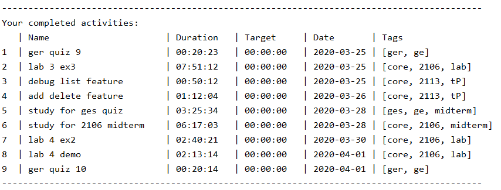

# User Guide

## Introduction

{Give a product intro}

## Quick Start

{Give steps to get started quickly}

1. Ensure that you have Java 11 or above installed.
1. Down the latest version of `Duke` from [here](http://link.to/duke).

<<<<<<< HEAD
## Features 
=======
## Usage
Jikan lets you record how much time you spend on various activities so that you can easily see what took up the most time today / this week / this month.

To start, record your first activity using the `start ACTIVITY_NAME` command. Add some tags to your activities to group similar activities together. When you are done with the activity, or want to move onto something else, tell Jikan to `end` and the Activity time will be recorded and saved to your list.

You can view all your activities using the `list` command. Activities will be shown in this format:

You can also view all your activities over a period of time by using `list` with extra parameters. For example `list week` will return a list of all activities this current week, as shown below.

Filter out the activities you want to see using the `find` or `filter` command. This is our list after filtering out all our activities tagged as `core`. 

To easily see what took up the most of your time, use the `graph` command to view a chart of your activities. 

Now it's clear that lab 3 ex3 took up the most of your time. 

Not done with an activity and want to continue it? Use the `continue` command to continue recording time for a previously started activity.

Finally, when you're done and want to close the app, simply say `bye` and Jikan will exit.

This is just a quick overview of what Jikan can do for you. For more details on each individual command, read the command guide below.
>>>>>>> 6b02c0250b849489c2ac63312f0c566fecc8391b

{Give detailed description of each feature}
### Finding and Filtering Activities

## Finding Activities by Name: `find`
Users can request for a sub-list of activities that has names containing a given keyword to be printed.

Format: `find KEYWORD`

## Filtering Activities by Tags: `filter`
Users can request for a sub-list of activities that has specific tags.

Format: `filter TAGNAME1 TAGNAME2`

## Further Finding/Filtering: `-s`
Users can chain `find` and `filter` commands to generate an even smaller sub-list of activities based on his/her needs. 
This is can be particularly useful when the user wants to generate a `graph`.

This flag applies to `find` and `filter` commands only. 

Format: 
* `filter -s TAGNAME1 TAGNAME2`
* `find -s keyword`

### Adding a to-do: `todo`
Adds a to-do item to the list of to-dos.

Format: `todo n/TODO_NAME d/DEADLINE`

* The `DEADLINE` can be in a natural language format.
* The `TODO_NAME` cannot contain punctuation.  

Example of usage: 

`todo n/Write the rest of the User Guide d/next week`

`todo n/Refactor the User Guide to remove passive voice d/13/04/2020`

## FAQ

**Q**: How do I transfer my data to another computer? 

**A**: Well, write the User Guide in active voice anyway.

## Command Summary

{Give a 'cheat sheet' of commands here}

* Add to-do `todo n/TODO_NAME d/DEADLINE`
